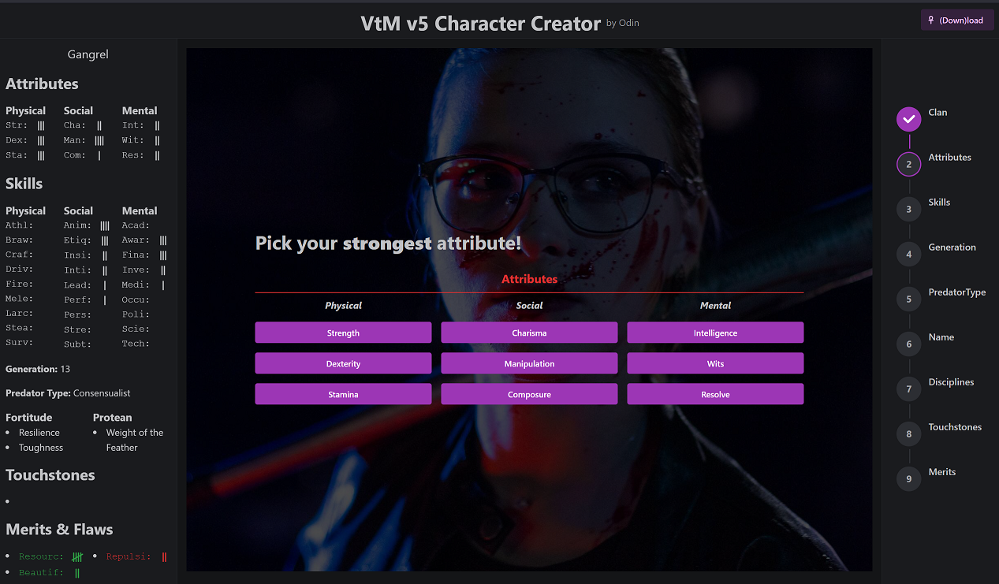

  

<h1 align="center">
  
⚰️ Progeny 🦇

  
A Vampire the Masquerade v5 Character Creator

</h1>

Quickly and easily create your VTM character & export to printable, editable PDF.
[Link](https://progeny.odin-matthias.de)

The creator runs entirely in your browser, no files are sent to a server.

This is a 'Vampire: The Masquerade' character creation tool for beginners. It is intentionally streamlined and limited to creating a common type of character following the rules from the source book. You can download your character into a printable PDF when you're done (PDF template kindly provided by [Nerdbert](https://linktr.ee/nerdbert)) and also save it to a local JSON file that you can load into this web app to continue editing.

## How to run
* `npm install`
* `npm start`

* (optional) create `.env` file and enter environment variables like `REACT_APP_VARIABLE_NAME = 'some value'`

## How to use

<!-- ## How to use your own fillable pdf
* Convert your pdf to base64 (you can use `scripts/pdfToBase64.ts`)
* Import & load it in `pdfCreator.ts`
* Use `printFieldNames()` to get names of fillable fields
* Map character attributes generated in `Generator.tsx` to pdf field names -->

<!-- ## TODOs:
* Add meaningful-ish error messages when things go wrong
* Give people a way to give feedback

* Ask for feedback in VtM spaces

* Add rituals for blood sorcery

* Make website usable on mobile
* Make things prettier in general
* Fix: Setting Specialites, then going back and setting new specialties keeps the old ones
* -->

## Credits & Acknowledgements
* VtM is owned by https://www.worldofdarkness.com/dark-pack
* The PDF template used for exporting is made by [Nerdbert](https://linktr.ee/nerdbert)
* CheckSolid.base64 is converted from fontawesome
* FavIcon, Discipline-Icons provided by [Nerdbert](https://drive.google.com/drive/folders/166CN03nsT6VF-cjjttS0uBfvMZRoNqgK)
* Background images by Aleksandr Popov, Amber Kipp, Dominik Hofbauer, Marcus Bellamy, Peter Scherbatykh, Thomas Le on [unsplash](unsplash.com)

