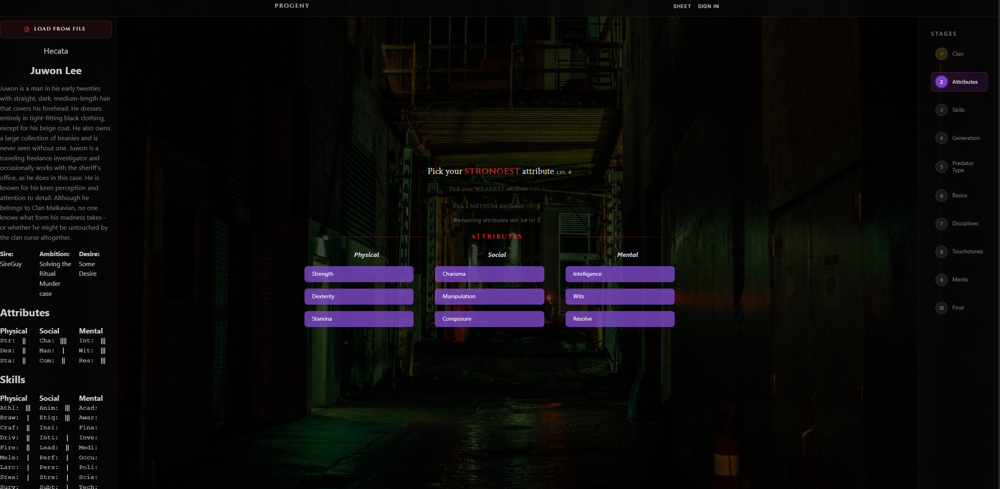
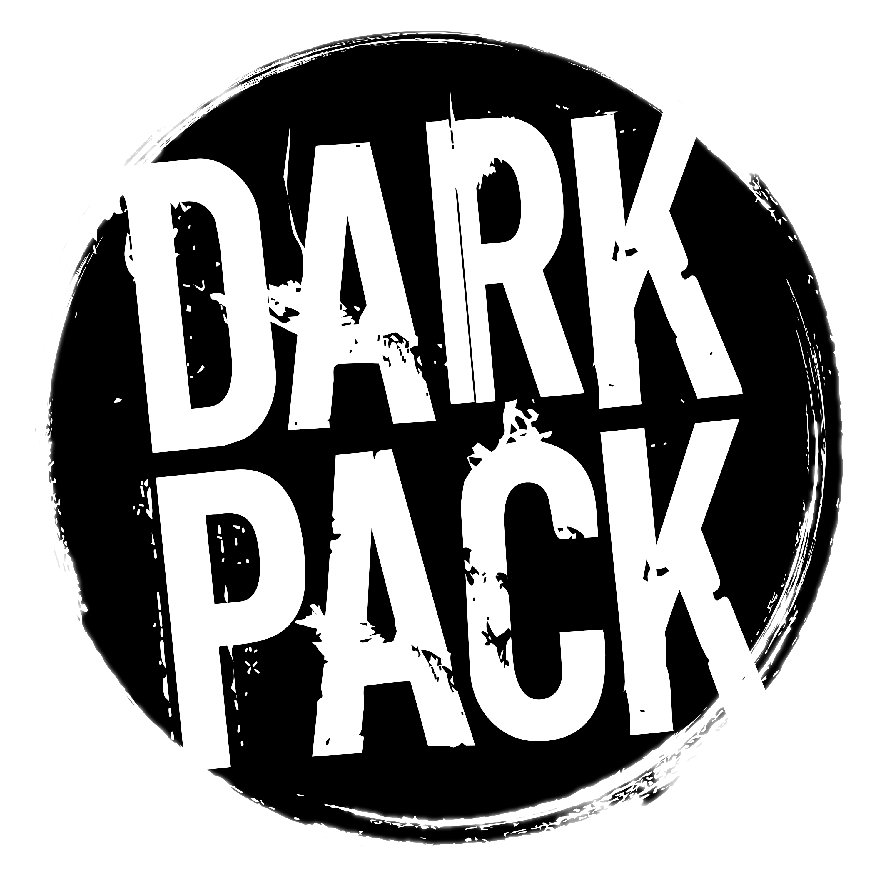

<p align="center">
  <a href="https://www.odin-matthias.de">
    
  </a>
</p>
<h1 align="center">
  <div>⚰️ Progeny 🦇</div>
  <div style="font-size: 20px;">A 'Vampire: the Masquerade' 5th Edition Character Creator</div>
</h1>


Quickly and easily create your VTM character & export to printable, editable PDF.
[Link](https://progeny.odin-matthias.de)



The creator runs entirely in your browser, no files are sent to a server.

This is a 'Vampire: The Masquerade' character creation tool for beginners. It is intentionally streamlined and limited to creating a common type of character following the rules from the source book. You can download your character into a printable PDF when you're done (PDF template kindly provided by [Nerdbert](https://linktr.ee/nerdbert)) and also save it to a local JSON file that you can load into this web app to continue editing.

If you want to buy me a coffee, you can toss me some coins over here: https://ko-fi.com/odin_dev


## How to run

### Frontend
```bash
cd frontend
pnpm install
pnpm start
```

* (optional) create `frontend/.env` file and enter environment variables like `VITE_VARIABLE_NAME = 'some value'`

### Backend
```bash
cd backend
pnpm install
pnpm run dev
```

### Backend production deployment

Pushing changes under `backend/` to `main` deploys the triggering commit to the
Hetzner backend through `.github/workflows/deploy-backend.yml`. The remote
deployment uses the existing `backend/scripts/updateCode.sh` script, which
backs up the database, checks out that exact revision, installs locked
dependencies, builds, migrates, restarts PM2, and checks the health endpoint.

Configure these repository Action secrets before the first deployment:

- `HETZNER_SSH_PRIVATE_KEY`: a dedicated private key authorized for the
  `progeny` user on the server.
- `HETZNER_SSH_KNOWN_HOSTS`: the trusted host-key entry for `46.224.62.32`.
  The workflow pins the server's ED25519 key. Obtain its fingerprint from the
  Hetzner console or an already-verified connection (for example,
  `ssh-keygen -lf /etc/ssh/ssh_host_ed25519_key.pub` on the server). Compare it
  with a candidate produced by `ssh-keyscan -t ed25519 -H 46.224.62.32`, and
  only save that verified candidate as the secret value.

The workflow intentionally uses strict host-key checking and does not accept a
new host key during deployment. Configure GitHub's native failure-only Actions
email notifications in [Notification settings](https://github.com/settings/notifications):
under **System → Actions**, choose **Email** and **Only notify for failed
workflows**. The repository must be watched for workflow notifications.

You can optionally run both conveniently with `mprocs` (only tested on Windows):
* `pnpm add -g mprocs`
* `mprocs`


## How to manually create a loadable json character / fix a broken json file
Check the `characterSchema` in `shared/src/schemas/Character.ts` to get an idea for the expected format. If you can't make it work, feel free to create an issue on Github or contact me.


## Exports to other systems
Progeny lets you export your character to several formats:
* Progeny-compatible json to save your characters for future editing
* PDF (kindly provided by Nerdbert)
* [Foundry VTT vtm5e](https://foundryvtt.com/packages/vtm5e)-compatible json

<!-- TODOdin: Add example json file -->

<!-- ## How to use -->

<!-- ## How to use your own fillable pdf
* Convert your pdf to base64 (you can use `scripts/pdfToBase64.ts`)
* Import & load it in `pdfCreator.ts`
* Use `printFieldNames()` to get names of fillable fields
* Map character attributes generated in `Generator.tsx` to pdf field names -->


<!-- ## TODOs:
* Add free-text / select field where predator type says "pick XY"?
* Add free-text custom merit/flaw field(s) for users to input their own stuff

* Make instruction-text prettier / styled (check out similar web apps for how they do it?)
* Make merit/flaw picking prettier - maybe style it more like a character sheet (with the oooo)

* Ask for feedback in VtM spaces
  * Randomized name, ambition, desire etc
  * Post and ask for feedback again once you have all these completed (v2 release)

* Add more loresheets
* Fix: Setting Specialites, then going back and setting new specialties keeps the old ones
* Fix: Changing predator type should reset disciplines (like changing clan does, search "Because you changed your clan")
* -->


## Credits & Acknowledgements
* VtM is owned by https://www.worldofdarkness.com/dark-pack
* The PDF template used for exporting is made by [Nerdbert](https://linktr.ee/nerdbert)
* CheckSolid.base64 is converted from fontawesome
* [Fangs icon](https://thenounproject.com/browse/icons/term/fangs/) by 선식 양 from the [Noun Project](https://thenounproject.com) ([CC BY 3.0](https://creativecommons.org/licenses/by/3.0/))
* FavIcon, Discipline-Icons, dice result icons provided by [Nerdbert](https://drive.google.com/drive/folders/166CN03nsT6VF-cjjttS0uBfvMZRoNqgK)
* Background images by Aleksandr Popov, Amber Kipp, Dominik Hofbauer, Marcus Bellamy, Peter Scherbatykh, Thomas Le on [unsplash](unsplash.com)
* Roboto font from https://fonts.google.com/specimen/Roboto

<p align="center">

</p>
